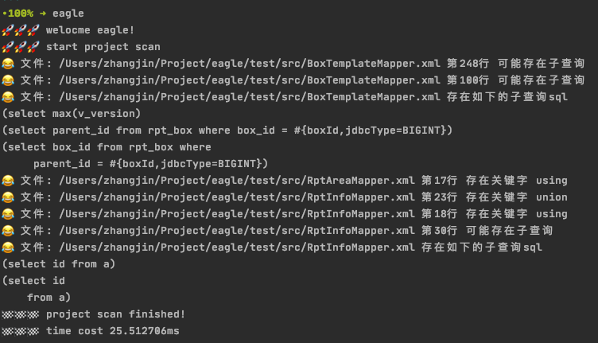
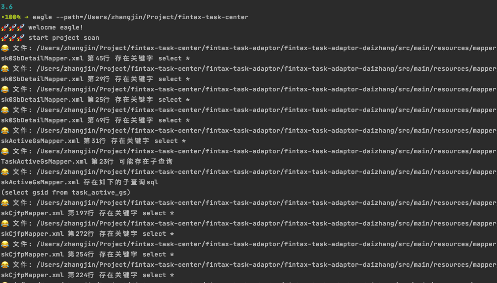
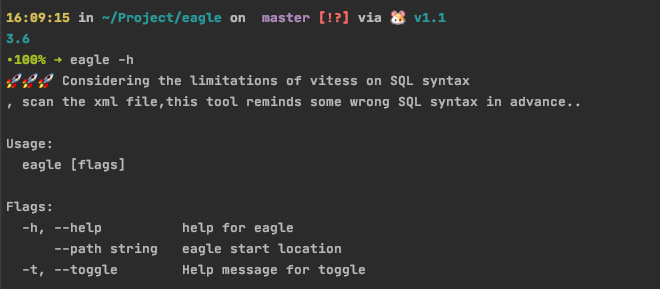

## eagle

##### eagle工具是为了迁移当前java项目接入到vitess的辅助项目，vitess经过分析整理，有很多不能执行的sql,之前有pdf文件 [vitess不支持语法](http://gitlab.yzf.net/PaaS-public/PaaS-Board/PaaS/Vitess/blob/master/vitess_sql%E4%B8%8D%E6%94%AF%E6%8C%81%E6%80%BB%E7%BB%93.pdf) 使用eagle就能快速扫描mybatis项目的sql，把问题sql，或者关键字做命令行提醒

### eagle特性

1. 扫描mybatis xml文件
2. 查询xml文件中的问题关键字
3. 解析xml文件中的子查询sql,并且打印sql语句
### 如何使用
1. 执行`egale`，会将当前路径当做项目路径进行扫描

2. 执行`egale --path=your path` 会执行输入的路径当做项目路径进行扫描

3. 查看`egale -h` 列出所有的帮助提示命令

### build 

1. 当前目录打包，生成可执行文件 执行`go build`
2. 然后再配置环境变量
`export PATH=$PATH:/Users/zhangjin/Project/eagle`
3. 全局使用
4. 构建linux下可执行文件
 `CGO_ENABLED=0 GOOS=linux GOARCH=amd64 go build eagle.go`